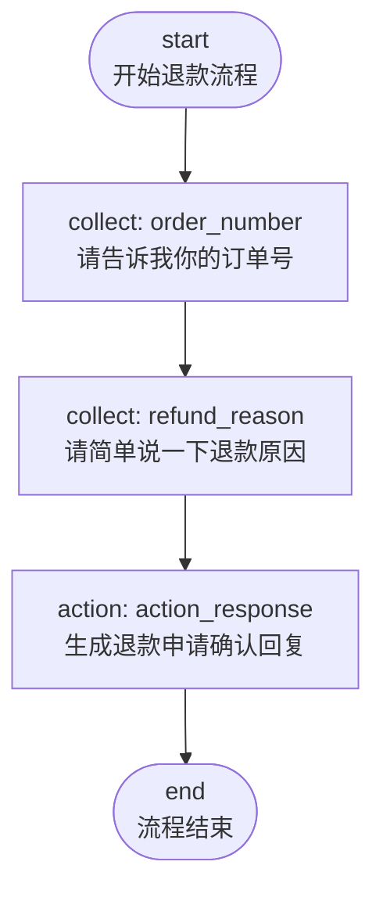
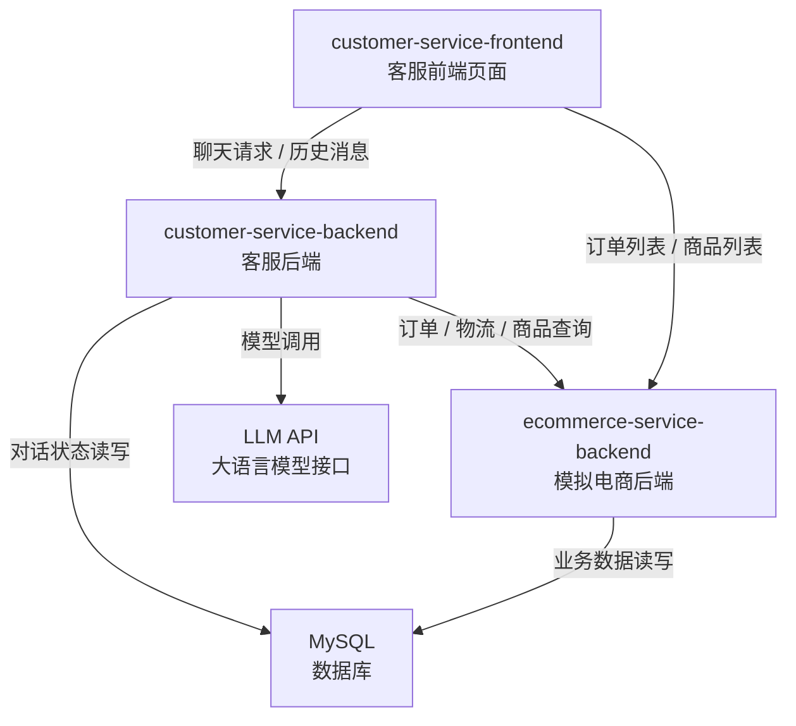
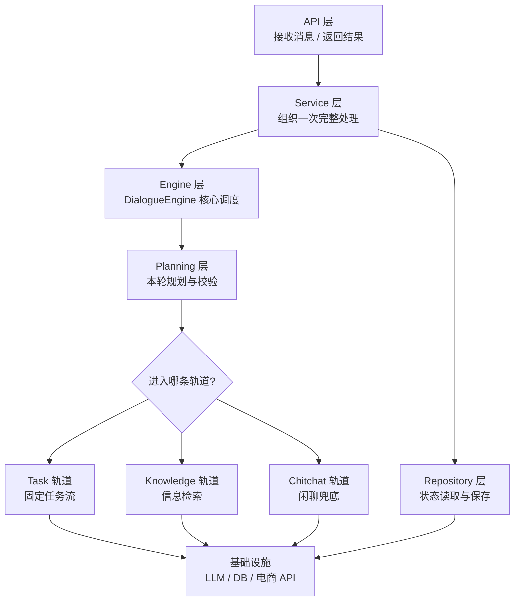
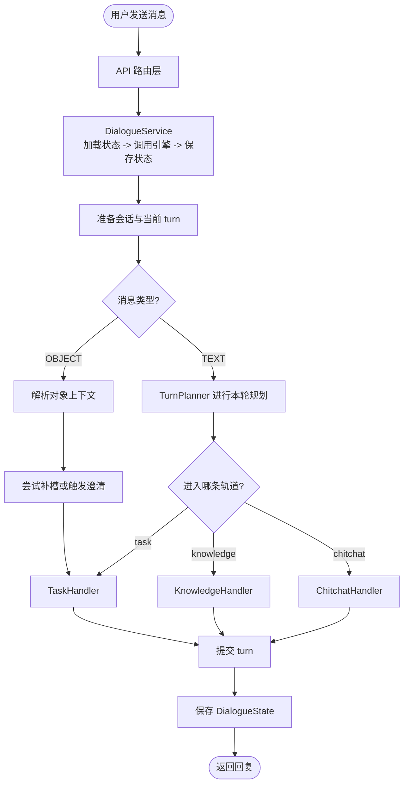

# 电商智能客服系统

---

## 第1章 项目概述

### 1.1 功能概览

这是一套面向电商场景的智能客服系统，主要支持三大类能力：

| 能力类型 | 说明 | 典型场景 |
|---------|------|---------|
| 任务流程 | 处理步骤明确的业务任务 | 申请退款、修改地址、查物流 |
| 信息检索 | 处理查询型问题 | 询问商品信息、退款政策 |
| 闲聊 | 处理轻量自然对话 | 打招呼、简单寒暄、模糊输入兜底 |

### 1.2 固定任务流程

固定任务流程，指的是那些步骤比较稳定、处理顺序比较明确、适合按步骤推进的客服任务。这类任务通常不是用户一句话就能直接完成，而是需要系统逐步收集信息、执行动作，并返回处理结果。

在当前项目中，比较典型的固定任务流程包括：

| 流程名称 | 触发场景 | 当前实现方式 |
|---------|---------|-------------|
| 订单状态查询 | “帮我查下订单状态” | 收集订单号 → 查询订单接口 → 回复结果 |
| 物流查询 | “我的快递到哪了” | 收集订单号 → 查询物流接口 → 回复结果 |
| 退款申请 | “我要退款” | 收集订单号 → 收集退款原因 → 返回提交确认文案 |

本项目支持通过 YAML 文件自定义业务流程。下面以“退款申请”流程为例进行说明：

```yaml
refund_request:
  name: 退款申请
  description: 帮用户提交简单的退款申请，收集订单号和退款原因。
  steps:
    - id: start
      type: start
      next: ask_order_number

    - id: ask_order_number
      type: collect
      slot_name: order_number
      response:
        text: "请告诉我你的订单号。"
      next: ask_refund_reason

    - id: ask_refund_reason
      type: collect
      slot_name: refund_reason
      response:
        text: "请简单说一下退款原因。"
      next: refund_submitted

    - id: refund_submitted
      type: action
      action: action_response
      args:
        text: "好的，订单{{ slots.order_number }}的退款申请已提交，原因是：{{ slots.refund_reason }}。后续会尽快为你处理。"
      next: end

    - id: end
      type: end
      next: []
```

从这个配置可以看出，一个业务流程是由多个步骤组成的。在当前示例中，主要涉及以下几种步骤类型：

- `start`：流程起点
- `collect`：收集某个槽位信息，例如订单号、退款原因
- `action`：执行动作并生成回复
- `end`：流程结束

其对应的流程图如下：



交互示例如下：

```text
用户：我想申请退款
客服：请发送你要退款的订单。
用户：[退款订单]
客服：请简单说一下退款原因。
用户：尺码不合适
客服：好的，订单 A20240315001 的退款申请已提交，原因是：尺码不合适。后续会尽快为你处理。
```

### 1.3 信息检索

除了固定任务流程之外，电商客服中还有大量问题并不要求系统“执行一个流程”，而是希望系统先查到相关信息，再用自然语言组织成回答返回给用户。这类问题就属于信息检索场景。

在当前项目中，信息检索相关的问题主要涵盖以下几个方面：

| 知识意图 | 示例问题 |
|---------|---------|
| 商品信息咨询 | “这件商品是什么材质？” |
| 订单信息咨询 | “这个订单现在是什么情况？” |
| 退款政策咨询 | “退款政策是怎样的？” |
| 退货政策咨询 | “支持退货吗？” |
| 配送政策咨询 | “多久发货？包邮吗？” |
| 平台规则咨询 | “平台有哪些限制规则？” |
| 通用电商问题 | “优惠券怎么用？” |

不同类型的问题，其检索方式并不完全相同。

- 商品信息、订单信息这类问题，通常需要调用业务 API 获取实时数据
- 退款政策、退货政策、配送政策这类问题，更适合通过 FAQ （Frequently Asked Questions）进行回答
- 退款政策、退货政策、配送政策这类问题，更适合通过 FAQ（Frequently Asked Questions，常见问题）进行回答
- 平台规则、通用电商问题这类内容，更适合通过知识库进行回答

也就是说，信息检索链路的核心思路不是“直接让模型自由回答”，而是先找到可信的信息来源，再让模型基于这些信息生成更自然的回复。

交互示例如下：

```text
用户：这件商品大概是什么情况？
客服：这件商品的名称是“轻薄连帽防晒衣”，当前价格为 129 元，库存状态为有货。
      如果你想进一步了解规格参数或售后信息，也可以继续问我。

用户：适合什么季节穿？
客服：从商品名称和描述来看，这是一件偏轻薄款的防晒衣，更适合春夏季节或日常通勤、户外防晒场景使用。

用户：那现在有货吗？
客服：当前库存状态为有货。如果你需要，我也可以继续帮你看看这件商品的更多信息。
```

### 1.4 闲聊

当用户输入的内容不属于明确任务，也不适合走知识检索时，系统会进入闲聊轨道。

闲聊能力的作用主要是：

- 让系统对话体验更自然
- 在轻量输入场景下给出合理回应
- 在系统暂时无法进入明确业务流程时提供兜底体验

#### 交互示例

```text
用户：你好
客服：你好，这里是 Atguigu 电商助手。我可以帮你查订单状态、查物流、了解商品信息，或者提交退款申请。

用户：你还挺聪明
客服：谢谢夸奖。如果你有订单、物流或者商品相关的问题，我都可以继续帮你看一下。
```

## 第2章 项目开发环境

### 2.1 整体环境说明

项目所需环境如下：

- `customer-service-backend/`：客服后端服务（课程核心）
- `customer-service-frontend/`：客服前端页面
- `ecommerce-service-backend/`：模拟电商业务后端
- `docker/`：MySQL 容器环境

### 2.2 各组件关系图

下面这张图展示了各组件之间的协作关系：



### 2.3 客服后端 `customer-service-backend/`

这是本项目的核心，也是后续重点学习的部分。

它主要负责：

- 接收用户消息
- 读取和保存对话状态
- 判断当前应进入任务流、知识检索还是闲聊
- 调用大模型完成规划和回复生成
- 调用模拟电商服务获取业务事实

当前使用的主要技术包括：

- FastAPI：提供 HTTP 接口
- LangChain：封装模型调用
- SQLAlchemy：进行数据库访问
- Pydantic：配置和数据结构定义
- Jinja2：Prompt 模板渲染
- PyYAML：流程配置文件加载

### 2.4 客服前端 `customer-service-frontend/`

前端页面是一个教学用的可视化控制台，目的是让你更方便地观察客服系统的行为。

当前页面主要包括两个区域：

- 左侧聊天区：发送文本消息、查看回复和历史记录
- 右侧对象区：显示当前用户的订单和商品，并支持发送对象消息


### 2.5 模拟电商后端 `ecommerce-service-backend/`

模拟电商后端的作用，是为客服系统提供可查询的业务数据。

它当前提供的典型接口包括：

| 接口 | 作用 |
|------|------|
| `GET /users/{user_id}/orders` | 获取某用户最近订单列表 |
| `GET /users/{user_id}/products` | 获取某用户最近商品列表 |
| `GET /orders/{order_id}` | 获取订单详情 |
| `GET /orders/{order_id}/status` | 获取订单状态 |
| `GET /orders/{order_id}/logistics` | 获取物流信息 |
| `GET /products/{product_id}` | 获取商品详情 |
| `POST /orders/{order_id}/shipping-reminders` | 创建催发货提醒 |
| `POST /orders/{order_id}/refund-applications` | 创建退款申请 |

### 2.6 数据库与 Docker 环境

项目通过 `docker/docker-compose.yml` 提供 MySQL 容器环境。

它在教学上的作用主要有两类：

- 为模拟电商后端提供业务数据存储
- 为客服后端提供对话状态存储

其中，客服后端保存的是每个用户的一整份 `DialogueState`，以 JSON 形式存入数据库，而不是拆成很多张复杂业务表。这种设计更适合教学阶段理解多轮对话状态。

### 2.7 环境启动说明

建议按下面顺序启动环境：

#### 第一步：启动数据库

```bash
cd docker
docker compose up -d
```

#### 第二步：启动模拟电商后端

```bash
cd ecommerce-service-backend
uv sync
uv run python main.py
```

#### 第三步：配置并启动客服后端

在 [customer-service-backend/.env](/Users/liubo/Workspace/agent/ecommerce-customer-service/customer-service-backend/.env) 中确认这些关键配置：

- `LLM_MODEL`
- `LLM_BASE_URL`
- `LLM_API_KEY`
- `COMMERCE_API_BASE_URL`
- `DATABASE_URL`
- `APP_HOST`
- `APP_PORT`

然后启动：

```bash
cd customer-service-backend
uv sync
uv run python main.py
```

#### 第四步：启动前端

```bash
cd customer-service-frontend
npm install
npm run dev
```

启动后访问 [http://127.0.0.1:5173](http://127.0.0.1:5173) 即可看到页面。

## 第3章 项目架构

### 3.1 总体设计思路

核心设计思路如下图所示：



### 3.2 一条消息的完整处理流程

下面这张图展示了一条用户消息从进入系统到生成回复的大致流程：



### 3.3 系统分层结构

从目录和代码职责上看，这套对话系统大致可以分为下面几层：

| 层次 | 主要职责 |
|------|---------|
| API 层 | 接收 HTTP 请求，组织请求与响应 |
| Service 层 | 把一次对话处理串起来 |
| Engine 层 | 顶层调度，决定走哪条处理轨道 |
| Planning 层 | 负责本轮规划、意图判断与校验 |
| Task 层 | 负责固定任务流推进 |
| Knowledge 层 | 负责信息检索与回答 |
| Chitchat 层 | 负责闲聊与兜底回复 |
| Repository / Infrastructure 层 | 负责状态存储、数据库、模型和 HTTP 能力 |
